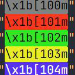

# 
[Ansi Color Highlight](https://github.com/SEVEN-1-bit/vscode-ext-ansi-color-highlight)

This extension styles ansi colors found in your document.

## Install

In VSC press Ctrl+Shift+P (Cmd+Shift+P on Mac) then type ">ext install", hit enter, search "Ansi Color Highlight".

Still confused? Click "Get Started" above.

## Preview

